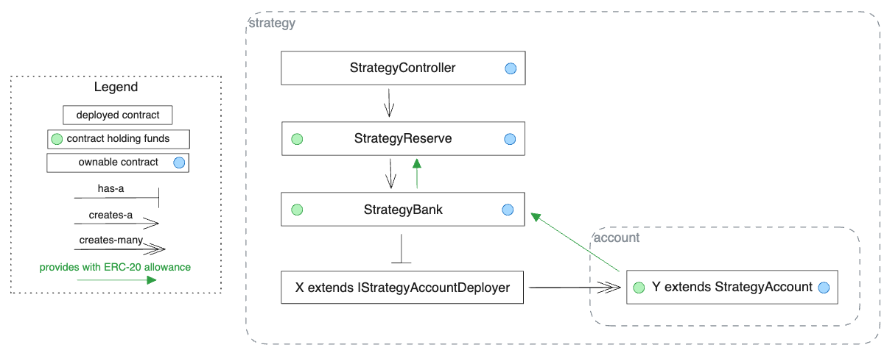
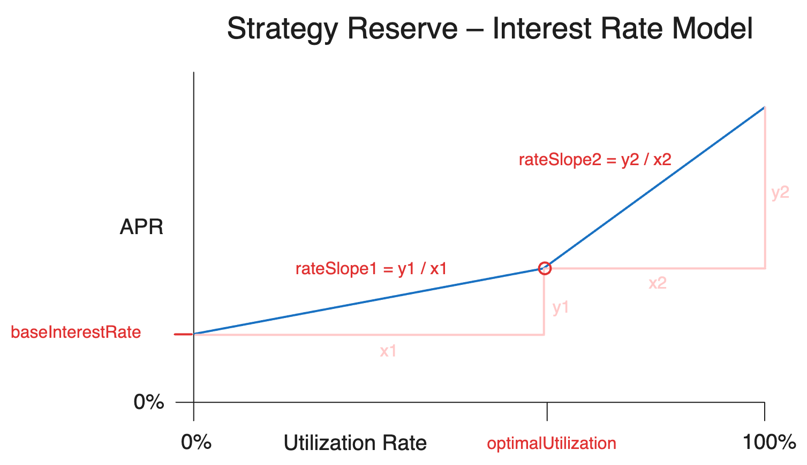

    

# GoldLink Contracts

Core Contracts for the GoldLink Protocol V1. All of lending, borrowing and the risk-engine are present in this repository.

## Local Development

### Installation

When first cloning the repository, run `forge install` after installing [foundry](https://github.com/foundry-rs/foundry).

Also run `npm install`

### Formatting

`npm run fmt`

### Cloning

When first cloning the repository, run `forge install` after installing [foundry](https://github.com/foundry-rs/foundry).

### Running Tests

GoldLink testing is powered by [foundry](https://github.com/foundry-rs/foundry/tree/master/forge).

To use `console.log` within a file during testing, add `import "forge-std/Test.sol";` to the list of imports.

A few useful commands are:

- `forge test` to run all unit tests. Add `-vv` for verbose test results and `-vvv` for stack trace.
- `forge coverage` to run coverage checks.
- `forge coverage --report lcov` to generate a detailed coverage report. Works well
  with Coverage Gutters extension.
- `forge snapshot` generates `.gas-snapshot` to verify how much gas each test used.
- `forge test --match-test "testFuzz*"` will run all fuzz tests.
- `forge build --sizes` will compile contracts and return byte size.

### Dev Testing

Follow below steps of `Local Node` and `Deploying` to setup a node, deploy contracts to the node and fill a test wallet with mock funds universally used by the protocol.

#### Local Node

To run a local node call `anvil` in a separate terminal window.

## Deploying

Like above, make sure `forge` is installed for running all scripts.

Run `cp EXAMPLE.env .env` to get started with the basic configuration values.

### Deploy Mock Strategy

To create a mock deployment, first deploy the `GoldLinkErc20Mock` and `MockStrategyAccountDeployer` by running `forge script scripts/mock/DeployMockStrategy.sol --rpc-url <YOUR_RPC_URL> --broadcast`.

In your `.env` file, set `STRATEGY_ACCOUNT_DEPLOYER` to the `MockStrategyAccountDeployer` that was created by running the above command. Similarly,
set the `STRATEGY_ASSET` to the `GoldLinkErc20Mock` that was created.

See `scripts/testnet` for example scripts going through basic core functions. `.env` will need to be created and populated with referenced variables.

### Deploy Core Contracts

Make sure that `DEPLOYER_PRIVATE_KEY`, `STRATEGY_OWNER`, `STRATEGY_ASSET`, `STRATEGY_ACCOUNT_DEPLOYER` are set in your `.env` file.

Then, run `forge script scripts/DeployStrategyCore.sol --rpc-url <YOUR_RPC_URL> --broadcast`.

### ABI

To generate the abi run `forge inspect ${CONTRACT} abi > abi/${CONTRACT}.json`

## User Entry Points

- `StrategyBank`: Deploying a new `StrategyAccount`.
- `StrategyReserve`: Lending into the protocol.
- `StrategyAccount`: Engaging the strategy as a borrower.

## Flow

### Strategy Core Protocol

- Each strategy is made up of, generically, a `StrategyController`, `StrategyReserve` and `StrategyBank`.
- A strategy is deployed by constructing a `StrategyController` contract, which will then construct the `StrategyReserve` and `StrategyBank` contracts.
- The only portion of the strategy that is not generic in the strategy deployment is the `IStrategyAccountDeployer` in the bank parameters.

### Strategy Controller

- This contract can pause the `StrategyReserve` and `StrategyBank` when called by the contract's
  owner.
- This contract contains a lock used to protect against reentrancy attacks. The lock can only be set/unset by this contract's `StrategyReserve` and `StrategyBank. Once set or unset a second attempt to set or unset will cause the call to revert.

### Strategy Reserve

- This contract is an ERC4626 vault using the standard Open-Zeppelin implementation, and a configurable max TVL. Depositors are called “lenders”.
- A single address called the `STRATEGY_BANK` is authorized to borrow funds. These funds are withdrawn but remain on the books as “utilized” funds.
- Utilized funds accrue interest at a rate that is a function of the utilization ratio utilized funds / total funds.
- Although interest accrues (i.e. becomes due) continuously, it is only realized (i.e. received as gain by lenders) when a state-changing function is called on the reserve — specifically, those that may affect the utilization ratio or the interest rate model.
- The bank makes repayments at its discretion. Lenders can incur loss on utilized funds at the discretion of the bank.
- Other details: ownable, as well as pausable and reentrancy guard through a strategy level controller defined at strategy deployment time.

#### Interest Rate Model

- Interest accrues continuously (every second) against balances borrowed
  from the reserve. The interest rate calculation is performed in the
  `StrategyReserve` contract and utilizes an interest index to represent the cumulative
  interest owed to the reserve since the reserve was first initialized.
- Interest does not compound, as accrued interest is debited from the
  collateral balances held in the bank as opposed to
  being added to borrower's loan balances.

The utilization rate is the ratio between borrowed assets and total assets
of the reserve. In the `StrategyReserve` contract this is calculated as:

`utilizationRate = utilizedAssets_ / (utilizedAssets_ + reserveBalance_)`

The interest rate curve is calculated via a piecewise function with two defining
intervals:

When `utilizationRate <= optimalUtilization_`:
`interestRate = baseInterestRate_ + utilizationRate * rateSlope1_`

When `utilizationRate > optimalUtilization_`:
`interestRate = baseInterestRate* + optimalUtilization_ * rateSlope1_ + (utilizationRate - optimalUtilization_) * rateSlope2_`

### Strategy Bank

- Responsible for deploying individual `StrategyAccount`. Anyone can deploy a new account. Otherwise, only accessible from the `StrategyReserve`, `StrategyAccount` or owner.
- Maintains ledger of all valid `StrategyAccount` contracts associated with the strategy.
- A single address called the `STRATEGY_RESERVE` is authorized to take assets from this contract as interest.
- After depositing collateral on behalf of and through a `StrategyAccount` (with a few owner exceptions), the same `StrategyAccount` can request a loan through this contract. This contract will then transfer assets from the `StrategyReserve` to the `StrategyAccount`.
- Loans are restricted to `minimumOpenHealthScore_` against the collateral. When withdrawing, `minimumOpenHealthScore_` must still be respected if there is an outstanding loan. `minimumOpenHealthScore_` can be modified by the owner.
- Responsible for certifying that a `StrategyAccount` is liquidatable as well as processing liquidations.
- Builds an insurance fund on each interest payment as well as on healthy (where some collateral remains) liquidations.
- Other details: ownable, as well as pausable and reentrancy guard through a strategy level controller defined at strategy deployment time.

### Strategy Account Deployer

- Called through the `StrategyBank`, responsible for deploying individual `StrategyAccount`.

### Strategy Account

- The prime broker that holds the loan and engages upstreams.
- Each `StrategyAccount` is owned by EOA that dictates collateral and loan management as well as engagement with the individual strategy as the "borrower".
- Liquidations are identified in this contract. Once `executeInitiateLiquidation`, the account can be fully liquidated and no other actions by the borrower are possible until the liquidation completes.
- Once identified, liquidations are also processed starting in this contract.
- Other details: ownable, as well as pausable and reentrancy guard through a strategy level controller defined at strategy deployment time.

## GMX Funding-Rate Farming Flow

## GoldLink Glossary

1. `Holdings`, `Borrower Holdings`: An object that stores information related to a borrower's collateral, loan liability and interest owed.
   - `Loan`: The amount of assets borrowed from lenders. This is the initial amount of assets that were borrowed from lenders, and the base for what needs to be repaid (does not include interest).
   - `Collateral`: The amount of collateral posted by the borrower to back their loan. This is kept in the `StrategyBank` contract until the borrower withdraws or is fully liquidated.
   - `interestOwed`: The assets owed from collateral as interest to the `StrategyReserve` and insurance to the `StrategyBank`.
